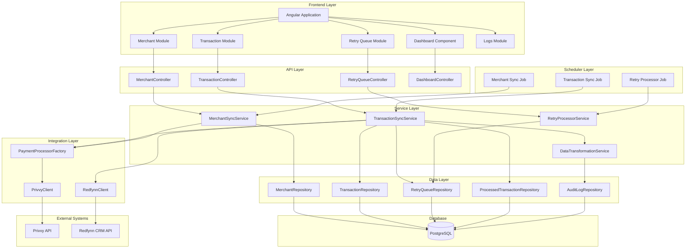
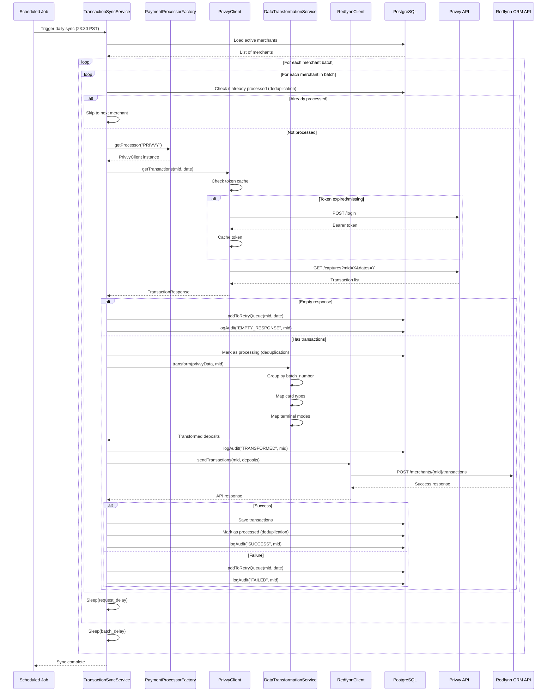
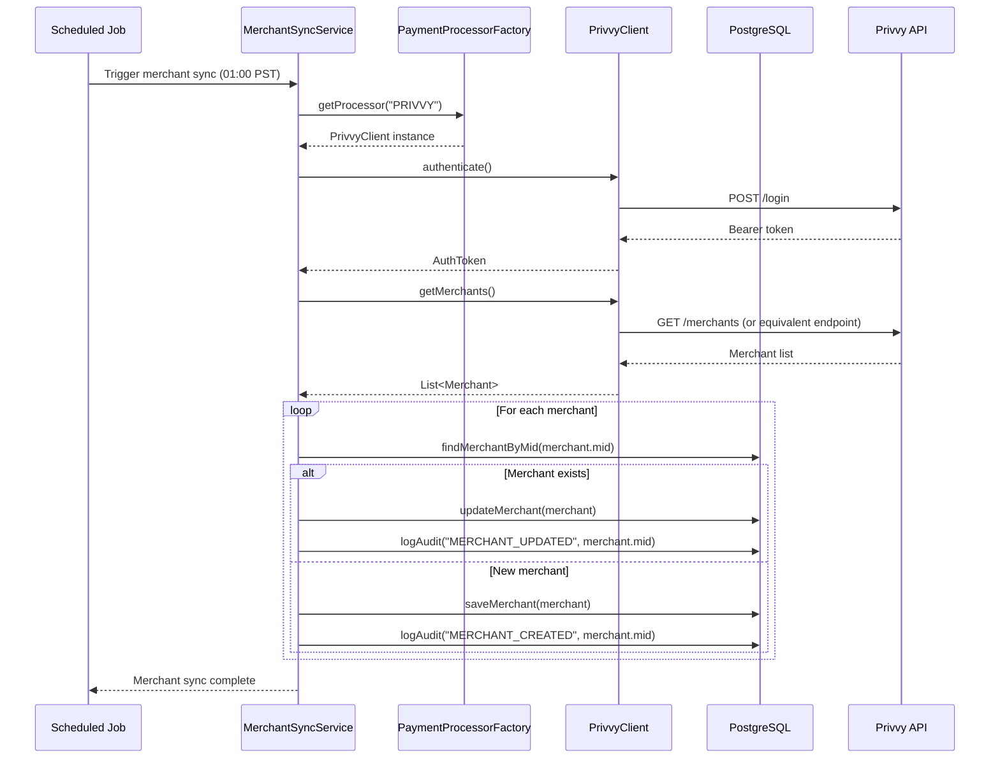
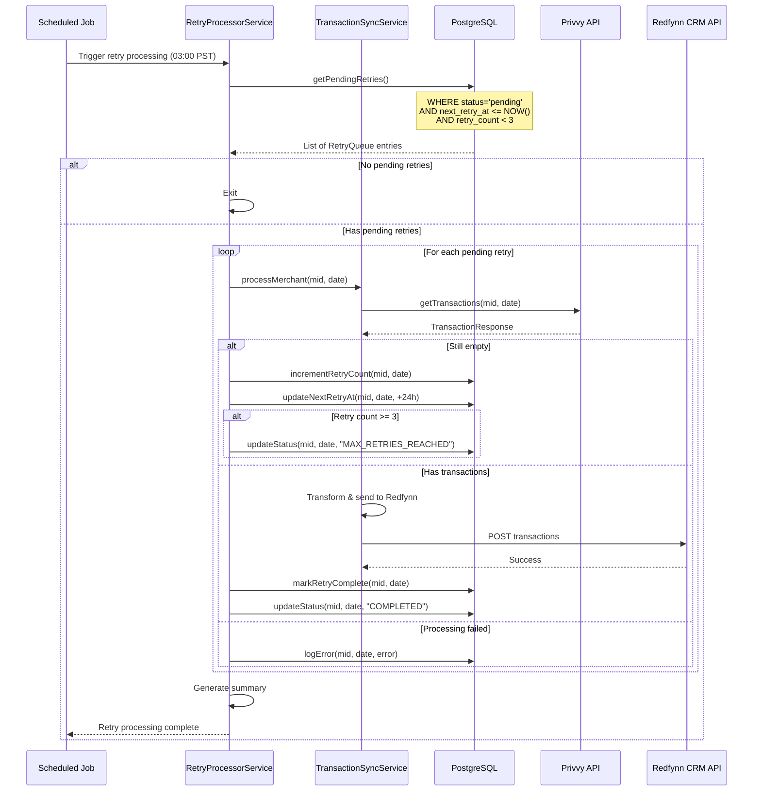

# Transaction Sync Service - Spring Boot & Angular Implementation Plan

## Table of Contents
1. [Overview](#overview)
2. [Business Requirements](#business-requirements)
3. [Technical Architecture](#technical-architecture)
4. [Component Details](#component-details)
5. [System Diagrams](#system-diagrams)
6. [Implementation Phases](#implementation-phases)
7. [Security Considerations](#security-considerations)
8. [Error Handling & Resilience](#error-handling--resilience)
9. [Data Flow](#data-flow)
10. [Technology Stack](#technology-stack)

---

## Overview

Transaction Sync Service is a Spring Boot backend with Angular frontend that synchronizes payment transaction data from **Privvy** (payment processing platform) to **Redfynn** (CRM system). The system processes multiple Merchant IDs (MIDs) daily, transforms transaction data between different formats, and includes robust error handling, retry mechanisms, and data deduplication.

### Key Features
- **Automated Daily Processing**: Scheduled pipeline runs at 23:30 PST
- **Batch Processing**: Processes MIDs in configurable batches with delays
- **Data Transformation**: Converts Privvy transaction format to Redfynn deposit format (preserved from Python implementation)
- **Retry Mechanism**: Handles empty responses with automatic retry queue
- **Merchant Management**: Fetches and stores merchant list from Privvy API
- **Payment Processor Abstraction**: Extensible design for multiple payment processors
- **Data Deduplication**: Prevents duplicate transaction processing
- **Comprehensive Logging**: Detailed logging at each pipeline stage
- **Security**: End-to-end encryption, secure credential management
- **Web Dashboard**: Angular frontend for monitoring and management

---

## Business Requirements

### Primary Objectives
1. **Data Synchronization**: Automatically sync transaction data from Privvy to Redfynn CRM system on a daily basis
2. **Multi-Merchant Support**: Process transactions for 100+ merchant accounts (MIDs)
3. **Merchant Discovery**: Automatically fetch and maintain merchant list from Privvy
4. **Data Integrity**: Ensure all transaction data is accurately transformed and transmitted
5. **Reliability**: Handle temporary failures and empty responses gracefully
6. **Data Deduplication**: Prevent duplicate transaction processing
7. **Audit Trail**: Maintain detailed logs for troubleshooting and compliance
8. **Security**: Secure handling of sensitive payment data and credentials

### Business Rules
- **Processing Schedule**: Daily batch processing at 23:30 PST (previous day's transactions)
- **Empty Response Handling**: MIDs with empty responses are queued for retry after 24 hours
- **Retry Limits**: Maximum of 3 retry attempts per MID/date combination
- **Batch Processing**: Process MIDs in batches of 5 with configurable delays to avoid API rate limits
- **Transaction Grouping**: Group transactions by batch number for deposit creation
- **Merchant Sync**: Fetch merchant list from Privvy daily and update database
- **Idempotency**: Ensure transactions are not processed multiple times

### Success Criteria
- All MIDs processed successfully with transaction data synced to Redfynn
- Empty responses automatically retried until data is available or max retries reached
- Complete audit trail maintained for all processing stages
- System operates reliably with minimal manual intervention
- Zero duplicate transactions processed
- Secure credential and data handling

---

## Technical Architecture

### High-Level Architecture

The system follows a microservices-oriented architecture with clear separation of concerns:

```
┌─────────────────────────────────────────────────────────────────┐
│                    Angular Frontend (SPA)                       │
│  - Transaction Dashboard                                         │
│  - Merchant Management                                           │
│  - Log Viewer                                                    │
│  - System Monitoring                                             │
└────────────────────────────┬────────────────────────────────────┘
                             │ REST API (HTTPS)
                             │
┌────────────────────────────▼────────────────────────────────────┐
│              Spring Boot Backend (REST API)                     │
│  ┌──────────────────────────────────────────────────────────┐  │
│  │  API Layer (Controllers)                                  │  │
│  │  - TransactionController                                  │  │
│  │  - MerchantController                                     │  │
│  │  - RetryQueueController                                   │  │
│  │  - DashboardController                                    │  │
│  └──────────────────────────────────────────────────────────┘  │
│  ┌──────────────────────────────────────────────────────────┐  │
│  │  Service Layer                                            │  │
│  │  - TransactionSyncService                                 │  │
│  │  - MerchantSyncService                                    │  │
│  │  - RetryProcessorService                                 │  │
│  │  - DataTransformationService                             │  │
│  └──────────────────────────────────────────────────────────┘  │
│  ┌──────────────────────────────────────────────────────────┐  │
│  │  Integration Layer                                        │  │
│  │  - PaymentProcessorFactory                                │  │
│  │  - PrivvyClient (implements PaymentProcessor)            │  │
│  │  - RedfynnClient (CRM Integration)                        │  │
│  └──────────────────────────────────────────────────────────┘  │
│  ┌──────────────────────────────────────────────────────────┐  │
│  │  Scheduler Layer                                          │  │
│  │  - @Scheduled Jobs                                        │  │
│  │  - Transaction Sync Job (23:30 PST)                      │  │
│  │  - Retry Processor Job (03:00 PST)                       │  │
│  │  - Merchant Sync Job (Daily)                              │  │
│  └──────────────────────────────────────────────────────────┘  │
└────────────────────────────┬────────────────────────────────────┘
                             │
                             ▼
┌─────────────────────────────────────────────────────────────────┐
│                    PostgreSQL Database                          │
│  - merchants (merchant information)                              │
│  - transactions (transaction data)                              │
│  - retry_queue (failed transaction retries)                     │
│  - audit_logs (system audit trail)                             │
│  - application_logs (application logs)                          │
│  - processed_transactions (deduplication tracking)             │
└─────────────────────────────────────────────────────────────────┘
                             │
                             │
┌────────────────────────────┴────────────────────────────────────┐
│                    External Systems                              │
│  ┌──────────────────────┐  ┌──────────────────────┐            │
│  │   Privvy API         │  │   Redfynn CRM API    │            │
│  │   - Authentication   │  │   - Transaction POST  │            │
│  │   - Merchant List    │  │   - API Key Auth     │            │
│  │   - Transactions     │  │                      │            │
│  └──────────────────────┘  └──────────────────────┘            │
└─────────────────────────────────────────────────────────────────┘
```

### Technology Stack

#### Backend (Spring Boot)
- **Framework**: Spring Boot 3.x
- **Language**: Java 17+
- **Build Tool**: Maven or Gradle
- **Database**: PostgreSQL 15+
- **ORM**: Spring Data JPA / Hibernate
- **Scheduling**: Spring @Scheduled / Quartz
- **Security**: Spring Security (JWT)
- **HTTP Client**: Spring WebClient / RestTemplate
- **Caching**: Spring Cache (Redis/Caffeine)
- **Logging**: Logback / SLF4J
- **Testing**: JUnit 5, Mockito, TestContainers

#### Frontend (Angular)
- **Framework**: Angular 17+
- **Language**: TypeScript
- **State Management**: RxJS / NgRx (optional)
- **HTTP Client**: Angular HttpClient
- **UI Framework**: Angular Material / PrimeNG
- **Charts**: Chart.js / ng2-charts
- **Build Tool**: Angular CLI

#### Infrastructure
- **Database**: PostgreSQL (RDS)
- **Caching**: Redis (optional, for token caching)
- **Message Queue**: RabbitMQ / AWS SQS (optional, for async processing)
- **Monitoring**: Spring Actuator, Micrometer, Prometheus
- **Deployment**: Docker, AWS Elastic Beanstalk

---

## Component Details

### 1. Backend Components

#### 1.1 API Controllers

**TransactionController**
- `POST /api/v1/transactions/sync` - Manual trigger for transaction sync
- `POST /api/v1/transactions/sync/{mid}` - Sync specific merchant
- `GET /api/v1/transactions` - List transactions with pagination
- `GET /api/v1/transactions/{id}` - Get transaction details
- `GET /api/v1/transactions/merchant/{mid}` - Get transactions for merchant

**MerchantController**
- `GET /api/v1/merchants` - List all merchants
- `GET /api/v1/merchants/{mid}` - Get merchant details
- `POST /api/v1/merchants/sync` - Manual trigger for merchant sync
- `PUT /api/v1/merchants/{mid}` - Update merchant
- `GET /api/v1/merchants/stats` - Merchant statistics

**RetryQueueController**
- `GET /api/v1/retry-queue` - List pending retries
- `POST /api/v1/retry-queue/process` - Manual trigger retry processing
- `DELETE /api/v1/retry-queue/{id}` - Remove retry entry
- `GET /api/v1/retry-queue/stats` - Retry queue statistics

**DashboardController**
- `GET /api/v1/dashboard/stats` - Overall system statistics
- `GET /api/v1/dashboard/recent-activity` - Recent processing activity
- `GET /api/v1/dashboard/health` - System health status

#### 1.2 Service Layer

**TransactionSyncService**
- Orchestrates transaction synchronization process
- Processes MIDs in batches
- Coordinates with payment processor clients
- Handles empty responses and retry queue
- Manages data deduplication

**MerchantSyncService**
- Fetches merchant list from Privvy API
- Updates merchant database
- Handles merchant data synchronization

**RetryProcessorService**
- Processes pending retries from retry queue
- Re-attempts failed/empty transaction fetches
- Updates retry queue status

**DataTransformationService**
- Transforms Privvy transaction format to Redfynn deposit format
- Preserves transformation logic from Python implementation
- Handles card type mapping (Visa→VI, MasterCard→MC, etc.)
- Handles terminal mode mapping (Chip→05, Swipe→02, etc.)
- Groups transactions by batch number

**PaymentProcessorFactory**
- Factory pattern for payment processor abstraction
- Returns appropriate processor implementation (Privvy, future: Stripe, Square, etc.)
- Supports multiple payment processor integrations

#### 1.3 Integration Layer

**PaymentProcessor Interface**
```java
public interface PaymentProcessor {
    String getName();
    AuthToken authenticate();
    List<Merchant> getMerchants();
    TransactionResponse getTransactions(String mid, LocalDate startDate, LocalDate endDate);
    boolean isHealthy();
}
```

**PrivvyClient (implements PaymentProcessor)**
- Token management with caching (50-minute expiry)
- Merchant list retrieval
- Transaction retrieval
- Error handling and retry logic

**RedfynnClient (CRM Integration)**
- API key authentication
- Transaction submission (POST)
- Response validation
- Error handling

#### 1.4 Data Layer

**Repositories (Spring Data JPA)**
- `MerchantRepository` - Merchant CRUD operations
- `TransactionRepository` - Transaction CRUD operations
- `RetryQueueRepository` - Retry queue operations
- `ProcessedTransactionRepository` - Deduplication tracking
- `AuditLogRepository` - Audit log operations
- `ApplicationLogRepository` - Application log operations

**Entities**
- `Merchant` - Merchant information
- `Transaction` - Transaction data
- `RetryQueue` - Retry queue entries
- `ProcessedTransaction` - Deduplication tracking
- `AuditLog` - Audit trail entries
- `ApplicationLog` - Application log entries

#### 1.5 Scheduler Layer

**Scheduled Jobs**
- `@Scheduled(cron = "0 30 23 * * ?", zone = "America/Los_Angeles")` - Daily transaction sync at 23:30 PST
- `@Scheduled(cron = "0 0 3 * * ?", zone = "America/Los_Angeles")` - Retry processor at 03:00 PST
- `@Scheduled(cron = "0 0 1 * * ?", zone = "America/Los_Angeles")` - Merchant sync at 01:00 PST

### 2. Frontend Components (Angular)

#### 2.1 Modules

**DashboardModule**
- Overview statistics
- Recent activity feed
- System health indicators
- Quick actions

**TransactionModule**
- Transaction list with filtering
- Transaction details view
- Manual sync triggers
- Export functionality

**MerchantModule**
- Merchant list with search
- Merchant details
- Merchant statistics
- Manual merchant sync

**RetryQueueModule**
- Pending retries list
- Retry statistics
- Manual retry processing
- Retry history

**LogsModule**
- Application logs viewer
- Audit trail viewer
- Log filtering and search
- Real-time log streaming

**SettingsModule**
- System configuration
- User management
- API credentials management
- Schedule configuration

#### 2.2 Services

**ApiService**
- HTTP client wrapper
- Request/response interceptors
- Error handling
- Token management

**AuthService**
- Authentication state management
- JWT token handling
- User session management

**WebSocketService** (Optional)
- Real-time updates
- Live log streaming
- System notifications

---

## System Diagrams

### Component Diagram



### Sequence Diagram - Transaction Sync Flow



### Sequence Diagram - Merchant Sync Flow



### Sequence Diagram - Retry Processing Flow



---

## Implementation Phases

### Phase 1: Foundation & Core Infrastructure (Weeks 1-2)
- [ ] Spring Boot project setup with Maven/Gradle
- [ ] PostgreSQL database schema design and migration
- [ ] Basic entity classes (Merchant, Transaction, RetryQueue, etc.)
- [ ] Repository layer with Spring Data JPA
- [ ] Basic REST API controllers
- [ ] Spring Security setup with JWT
- [ ] Application configuration (application.yml)
- [ ] Logging configuration (Logback)
- [ ] Docker setup for local development

### Phase 2: Payment Processor Integration (Weeks 3-4)
- [ ] PaymentProcessor interface design
- [ ] PaymentProcessorFactory implementation
- [ ] PrivvyClient implementation
  - [ ] Authentication with token caching
  - [ ] Merchant list retrieval API integration
  - [ ] Transaction retrieval API integration
  - [ ] Error handling and retries
- [ ] RedfynnClient implementation
  - [ ] API key authentication
  - [ ] Transaction submission
  - [ ] Response validation
- [ ] Unit tests for integration clients

### Phase 3: Data Transformation (Week 5)
- [ ] DataTransformationService implementation
- [ ] Preserve Python transformation logic:
  - [ ] Card type mapping (Visa→VI, MasterCard→MC, Amex→AX, Discover→DC)
  - [ ] Terminal mode mapping (Chip→05, Swipe→02, Manual→01, Contactless→07)
  - [ ] Card number extraction (first6, last4)
  - [ ] Transaction grouping by batch number
  - [ ] Deposit creation logic
- [ ] Unit tests for transformation logic
- [ ] Integration tests comparing with Python output

### Phase 4: Transaction Sync Service (Week 6)
- [ ] TransactionSyncService implementation
- [ ] Batch processing logic
- [ ] Empty response handling
- [ ] Retry queue integration
- [ ] Data deduplication logic
- [ ] Scheduled job for daily sync (23:30 PST)
- [ ] Manual trigger endpoints
- [ ] Comprehensive error handling

### Phase 5: Merchant Sync Service (Week 7)
- [ ] MerchantSyncService implementation
- [ ] Merchant list fetching from Privvy
- [ ] Merchant database synchronization
- [ ] Scheduled job for merchant sync (01:00 PST)
- [ ] Manual trigger endpoints
- [ ] Merchant update/creation logic

### Phase 6: Retry Processor Service (Week 8)
- [ ] RetryProcessorService implementation
- [ ] Pending retry retrieval logic
- [ ] Retry processing workflow
- [ ] Retry count and status management
- [ ] Scheduled job for retry processing (03:00 PST)
- [ ] Manual trigger endpoints
- [ ] Retry statistics and reporting

### Phase 7: Data Deduplication & Audit (Week 9)
- [ ] ProcessedTransaction entity and repository
- [ ] Deduplication logic implementation
- [ ] Unique constraint on (mid, date, transaction_id)
- [ ] Audit logging service
- [ ] Application logging to database
- [ ] Log retention policies

### Phase 8: Angular Frontend - Foundation (Weeks 10-11)
- [ ] Angular project setup
- [ ] Routing configuration
- [ ] Authentication module (login/logout)
- [ ] HTTP interceptor for JWT tokens
- [ ] API service layer
- [ ] Shared components (header, sidebar, footer)
- [ ] UI framework integration (Angular Material/PrimeNG)

### Phase 9: Angular Frontend - Dashboard (Week 12)
- [ ] Dashboard module
- [ ] Statistics cards (total transactions, success rate, etc.)
- [ ] Recent activity feed
- [ ] System health indicators
- [ ] Charts and visualizations

### Phase 10: Angular Frontend - Transaction Module (Week 13)
- [ ] Transaction list component with pagination
- [ ] Transaction filtering and search
- [ ] Transaction details view
- [ ] Manual sync triggers
- [ ] Export functionality

### Phase 11: Angular Frontend - Merchant Module (Week 14)
- [ ] Merchant list component
- [ ] Merchant search and filtering
- [ ] Merchant details view
- [ ] Merchant statistics
- [ ] Manual merchant sync trigger

### Phase 12: Angular Frontend - Retry Queue Module (Week 15)
- [ ] Retry queue list component
- [ ] Retry statistics
- [ ] Manual retry processing trigger
- [ ] Retry history view

### Phase 13: Angular Frontend - Logs Module (Week 16)
- [ ] Application logs viewer
- [ ] Audit trail viewer
- [ ] Log filtering and search
- [ ] Real-time log streaming (WebSocket optional)

### Phase 14: Security & Performance (Week 17)
- [ ] Credential encryption (AWS Secrets Manager / Vault)
- [ ] API rate limiting
- [ ] Input validation and sanitization
- [ ] SQL injection prevention
- [ ] XSS protection
- [ ] CORS configuration
- [ ] Performance optimization
- [ ] Caching strategy (Redis/Caffeine)

### Phase 15: Testing & Documentation (Week 18)
- [ ] Unit tests (backend and frontend)
- [ ] Integration tests
- [ ] End-to-end tests
- [ ] API documentation (Swagger/OpenAPI)
- [ ] User documentation
- [ ] Deployment documentation

### Phase 16: Deployment & Monitoring (Week 19)
- [ ] AWS infrastructure setup
- [ ] CI/CD pipeline configuration
- [ ] Production deployment
- [ ] Monitoring setup (Spring Actuator, Prometheus)
- [ ] Alerting configuration
- [ ] Performance tuning

---

## Security Considerations

### Authentication & Authorization
- **JWT-based Authentication**: Secure token-based authentication for API access
- **Role-Based Access Control (RBAC)**: Different roles (Admin, Operator, Viewer)
- **Token Expiration**: Short-lived access tokens with refresh token mechanism
- **Password Policy**: Strong password requirements, password hashing (BCrypt)

### Data Security
- **Encryption at Rest**: Database encryption using PostgreSQL encryption
- **Encryption in Transit**: TLS 1.3 for all API communications
- **Credential Management**: 
  - Store API credentials in AWS Secrets Manager or HashiCorp Vault
  - Never store credentials in code or configuration files
  - Use environment variables or secure vault integration
- **PCI DSS Compliance**: 
  - Mask card numbers in logs (only store last4)
  - No storage of full card numbers
  - Secure handling of payment data

### API Security
- **Rate Limiting**: Prevent API abuse with rate limiting
- **Input Validation**: Comprehensive input validation on all endpoints
- **SQL Injection Prevention**: Use parameterized queries (JPA/Hibernate)
- **XSS Protection**: Sanitize all user inputs
- **CORS Configuration**: Restrict CORS to frontend domain only
- **API Versioning**: Version API endpoints (/api/v1/)

### Network Security
- **HTTPS Only**: Force HTTPS for all communications
- **Security Headers**: 
  - Content-Security-Policy
  - X-Frame-Options
  - X-Content-Type-Options
  - Strict-Transport-Security
- **VPC Isolation**: Deploy in private subnets where possible
- **Security Groups**: Restrictive firewall rules

### Audit & Compliance
- **Audit Logging**: Log all critical operations
- **Data Access Logging**: Track who accessed what data
- **Compliance Logging**: Maintain logs for compliance requirements
- **Log Retention**: Configurable log retention policies

---

## Error Handling & Resilience

### Error Handling Strategy

**API Error Responses**
```json
{
  "timestamp": "2024-01-15T10:30:00Z",
  "status": 500,
  "error": "Internal Server Error",
  "message": "Failed to fetch transactions",
  "path": "/api/v1/transactions/sync/476200404889",
  "requestId": "abc123",
  "details": {
    "mid": "476200404889",
    "errorCode": "PRIVVY_API_ERROR"
  }
}
```

**Error Categories**
1. **Transient Errors**: Network timeouts, temporary API unavailability
   - Strategy: Automatic retry with exponential backoff
   - Max retries: 3 attempts
   - Retry queue: Add to retry queue for later processing

2. **Permanent Errors**: Invalid credentials, malformed data
   - Strategy: Log error, skip processing, alert administrators
   - No retry attempts

3. **Empty Responses**: No transactions available
   - Strategy: Add to retry queue, retry after 24 hours
   - Max retries: 3 attempts

### Retry Mechanism

**Retry Queue Schema**
```sql
CREATE TABLE retry_queue (
    id BIGSERIAL PRIMARY KEY,
    mid VARCHAR(50) NOT NULL,
    process_date DATE NOT NULL,
    retry_count INT DEFAULT 0,
    last_retry_at TIMESTAMPTZ,
    next_retry_at TIMESTAMPTZ NOT NULL,
    status VARCHAR(20) DEFAULT 'pending',
    error_message TEXT,
    created_at TIMESTAMPTZ DEFAULT NOW(),
    updated_at TIMESTAMPTZ DEFAULT NOW(),
    UNIQUE (mid, process_date),
    INDEX idx_status_next_retry (status, next_retry_at),
    INDEX idx_pending (status, next_retry_at, retry_count)
);
```

**Retry Logic**
- Initial empty response → Add to retry queue, next_retry_at = NOW() + 24 hours
- Retry 1 → If still empty, increment retry_count, next_retry_at = NOW() + 24 hours
- Retry 2 → If still empty, increment retry_count, next_retry_at = NOW() + 24 hours
- Retry 3 → If still empty, mark status = 'max_retries_reached'

### Data Deduplication

**Processed Transaction Tracking**
```sql
CREATE TABLE processed_transactions (
    id BIGSERIAL PRIMARY KEY,
    mid VARCHAR(50) NOT NULL,
    process_date DATE NOT NULL,
    transaction_id VARCHAR(100),
    privvy_batch_number VARCHAR(50),
    status VARCHAR(20) NOT NULL,
    processed_at TIMESTAMPTZ DEFAULT NOW(),
    UNIQUE (mid, process_date, transaction_id, privvy_batch_number),
    INDEX idx_mid_date (mid, process_date)
);
```

**Deduplication Strategy**
1. Before processing: Check if (mid, date, transaction_id, batch_number) exists
2. If exists: Skip processing
3. If not exists: Process and mark as processed
4. Use database unique constraint to prevent duplicates

### Fallback Systems

**Payment Processor Fallback**
- If Privvy API is down: Queue requests for retry
- If Redfynn API is down: Store transactions locally, retry later
- Circuit breaker pattern: Stop calling failing APIs temporarily

**Database Fallback**
- Connection pooling: Handle database connection failures gracefully
- Transaction rollback: Ensure data consistency on failures
- Read replicas: Use read replicas for read operations (optional)

**Monitoring & Alerting**
- Health checks: `/actuator/health` endpoint
- Metrics: Track success rates, error rates, processing times
- Alerts: Notify on high error rates, API failures, queue buildup

---

## Data Flow

### Normal Transaction Sync Flow
1. **Scheduled Job** triggers at 23:30 PST
2. **TransactionSyncService** loads active merchants from database
3. **For each merchant** (in batches):
   - Check deduplication table (processed_transactions)
   - If not processed:
     - Fetch transactions from Privvy API
     - If empty → Add to retry queue
     - If has data:
       - Transform data using DataTransformationService
       - Mark as processing in deduplication table
       - Send to Redfynn API
       - If success → Mark as processed, save transactions
       - If failure → Add to retry queue
   - Sleep (request_delay)
4. **After batch**: Sleep (batch_delay)
5. **Complete**: Log summary, update statistics

### Merchant Sync Flow
1. **Scheduled Job** triggers at 01:00 PST
2. **MerchantSyncService** authenticates with Privvy
3. **Fetch merchant list** from Privvy API
4. **For each merchant**:
   - Check if merchant exists in database
   - If exists → Update merchant information
   - If new → Create merchant record
5. **Complete**: Log summary

### Retry Processing Flow
1. **Scheduled Job** triggers at 03:00 PST
2. **RetryProcessorService** queries retry queue:
   - Status = 'pending'
   - next_retry_at <= NOW()
   - retry_count < 3
3. **For each pending retry**:
   - Call TransactionSyncService.processMerchant()
   - If success → Mark retry as 'completed'
   - If still empty → Increment retry_count, update next_retry_at (+24h)
   - If retry_count >= 3 → Mark as 'max_retries_reached'
   - If failure → Log error, keep as 'pending'
4. **Complete**: Generate summary report

---

## Database Schema

### Core Tables

**merchants**
```sql
CREATE TABLE merchants (
    id BIGSERIAL PRIMARY KEY,
    mid VARCHAR(50) UNIQUE NOT NULL,
    name VARCHAR(255),
    status VARCHAR(20) DEFAULT 'active',
    created_at TIMESTAMPTZ DEFAULT NOW(),
    updated_at TIMESTAMPTZ DEFAULT NOW(),
    last_synced_at TIMESTAMPTZ,
    INDEX idx_status (status),
    INDEX idx_mid (mid)
);
```

**transactions**
```sql
CREATE TABLE transactions (
    id BIGSERIAL PRIMARY KEY,
    mid VARCHAR(50) NOT NULL,
    transaction_id VARCHAR(100),
    batch_number VARCHAR(50),
    amount DECIMAL(10,2),
    transaction_date DATE,
    auth_code VARCHAR(50),
    card_type VARCHAR(10),
    card_last4 VARCHAR(4),
    card_first6 VARCHAR(6),
    pos_entry_mode VARCHAR(2),
    transaction_type VARCHAR(20),
    is_voided BOOLEAN DEFAULT FALSE,
    redfynn_deposit_id VARCHAR(100),
    created_at TIMESTAMPTZ DEFAULT NOW(),
    INDEX idx_mid_date (mid, transaction_date),
    INDEX idx_batch (batch_number),
    FOREIGN KEY (mid) REFERENCES merchants(mid)
);
```

**retry_queue**
```sql
CREATE TABLE retry_queue (
    id BIGSERIAL PRIMARY KEY,
    mid VARCHAR(50) NOT NULL,
    process_date DATE NOT NULL,
    retry_count INT DEFAULT 0,
    last_retry_at TIMESTAMPTZ,
    next_retry_at TIMESTAMPTZ NOT NULL,
    status VARCHAR(20) DEFAULT 'pending',
    error_message TEXT,
    created_at TIMESTAMPTZ DEFAULT NOW(),
    updated_at TIMESTAMPTZ DEFAULT NOW(),
    UNIQUE (mid, process_date),
    INDEX idx_status_next_retry (status, next_retry_at),
    INDEX idx_pending (status, next_retry_at, retry_count),
    FOREIGN KEY (mid) REFERENCES merchants(mid)
);
```

**processed_transactions** (Deduplication)
```sql
CREATE TABLE processed_transactions (
    id BIGSERIAL PRIMARY KEY,
    mid VARCHAR(50) NOT NULL,
    process_date DATE NOT NULL,
    transaction_id VARCHAR(100),
    privvy_batch_number VARCHAR(50),
    status VARCHAR(20) NOT NULL,
    processed_at TIMESTAMPTZ DEFAULT NOW(),
    UNIQUE (mid, process_date, transaction_id, privvy_batch_number),
    INDEX idx_mid_date (mid, process_date),
    FOREIGN KEY (mid) REFERENCES merchants(mid)
);
```

**audit_logs**
```sql
CREATE TABLE audit_logs (
    id BIGSERIAL PRIMARY KEY,
    event_type VARCHAR(50) NOT NULL,
    entity_type VARCHAR(50),
    entity_id VARCHAR(100),
    user_id VARCHAR(100),
    action VARCHAR(50),
    details JSONB,
    ip_address VARCHAR(45),
    created_at TIMESTAMPTZ DEFAULT NOW(),
    INDEX idx_event_type (event_type),
    INDEX idx_created_at (created_at),
    INDEX idx_entity (entity_type, entity_id)
);
```

**application_logs**
```sql
CREATE TABLE application_logs (
    id BIGSERIAL PRIMARY KEY,
    log_level VARCHAR(20) NOT NULL,
    logger_name VARCHAR(255),
    message TEXT NOT NULL,
    exception_stack TEXT,
    thread_name VARCHAR(100),
    request_id VARCHAR(100),
    user_id VARCHAR(100),
    ip_address VARCHAR(45),
    endpoint VARCHAR(255),
    created_at TIMESTAMPTZ DEFAULT NOW(),
    INDEX idx_log_level (log_level),
    INDEX idx_created_at (created_at),
    INDEX idx_request_id (request_id)
);
```

---

## Configuration

### Application Configuration (application.yml)

```yaml
spring:
  application:
    name: transaction-sync-service
  
  datasource:
    url: jdbc:postgresql://localhost:5432/transaction_sync
    username: ${DB_USERNAME}
    password: ${DB_PASSWORD}
    hikari:
      maximum-pool-size: 10
      minimum-idle: 5
  
  jpa:
    hibernate:
      ddl-auto: validate
    show-sql: false
    properties:
      hibernate:
        dialect: org.hibernate.dialect.PostgreSQLDialect
        format_sql: true

transaction-sync:
  scheduler:
    transaction-sync:
      cron: "0 30 23 * * ?"
      timezone: "America/Los_Angeles"
      enabled: true
    retry-processor:
      cron: "0 0 3 * * ?"
      timezone: "America/Los_Angeles"
      enabled: true
    merchant-sync:
      cron: "0 0 1 * * ?"
      timezone: "America/Los_Angeles"
      enabled: true
  
  processing:
    batch-size: 5
    batch-delay-seconds: 2
    request-delay-seconds: 0.5
    max-retries: 3
    retry-delay-hours: 24
  
  privvy:
    api-url: ${PRIVVY_API_URL}
    email: ${PRIVVY_EMAIL}
    password: ${PRIVVY_PASSWORD}
    token-cache-minutes: 50
  
  redfynn:
    api-url: ${REDFYNN_API_URL}
    api-key: ${REDFYNN_API_KEY}

logging:
  level:
    com.transactionsync: INFO
    org.springframework.web: INFO
  appender:
    database:
      enabled: true
```

---

## Future Enhancements

### Phase 2 Features
1. **Multiple Payment Processors**: 
   - Stripe integration
   - Square integration
   - PayPal integration
   - Generic payment processor adapter

2. **Advanced Monitoring**:
   - Prometheus metrics
   - Grafana dashboards
   - Distributed tracing (Jaeger/Zipkin)
   - Real-time alerting

3. **Scalability**:
   - Horizontal scaling with load balancer
   - Message queue for async processing (RabbitMQ/SQS)
   - Database read replicas
   - Caching layer (Redis)

4. **Advanced Features**:
   - Webhook support for real-time updates
   - Data export functionality (CSV/Excel)
   - Advanced reporting and analytics
   - Multi-tenant support
   - API rate limiting per merchant

5. **DevOps**:
   - Kubernetes deployment
   - Blue-green deployments
   - Automated testing in CI/CD
   - Infrastructure as Code (Terraform)

---

## Contact & Support

[Add contact information here]

---

## License

[Add license information here]
